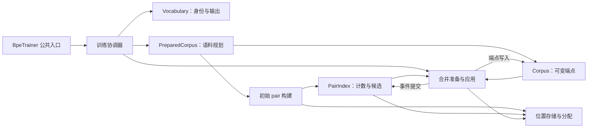

# BPE 训练引擎结构审阅与精简建议

## 1. 审阅结论与范围

当前 BPE 引擎还需要调整，而且包含应该直接删除的转发层和没有生产需求的接口。代码量膨胀有一部分来自必要算法，也有一部分来自把私有实现包装成通用库、补齐容器接口和为这些接口配套测试。后一部分增加了维护和审阅负担，应该清理。

从《软件设计的哲学》的角度看，问题集中在三个方面：

- **认知负担**：调用者需要理解身份复用、候选队列、事件顺序、存储生命周期及多个编号的关系。
- **变更放大**：字符过滤、affix 和物理坐标的规则在多个扫描流程中重复解释；规则与候选位置的对应关系需要多处保持一致。
- **接口暴露过多**：只有 BPE 使用的存储被设计成独立公共 crate，部分内部状态和无调用者的操作也被暴露。

主要模块边界有实际作用，但“有模块名”“封装了字段”“未来可以替换”都不能单独证明某一层有价值。建议删除没有独立责任的包装，保留已经支撑性能或正确性的机制，收回无实际需求的公开接口。文档用于解释最终保留的机制，不能补偿多余结构。

### 审阅基线

| 项目 | 基线 |
| --- | --- |
| 日期 | 2026-10-05 |
| 分支 | `bpe/posting-g128-pr` |
| HEAD | `5889f5ed105bf74fdf41a395b2e080c4a6797e8b` |
| 与 `upstream/main` 的共同基点 | `bbccb0513ff9afda385ca5c85c66eddb1318cfc7` |
| 现有消融所用 Full 实现 | `f9ff8b97fb38b248ceb89f6ca807fa09743c585c` |

本报告检查了 engine、`tk-collections`、BPE 公共入口、进度模块及现有 benchmark 材料，并汇总本次讨论中的后续建议。报告中的结构和接口示例都是提案，尚未实施。本次只新增此报告，没有修改 Rust 实现、迁移实验、删除文件或运行测试、benchmark。

`tk-train/BPE_DESIGN.md` 是早期实验向正式实现演进的重构计划。它属于历史材料，不能直接作为当前算法规格或正式 `DESIGN.md` 的权威来源。

## 2. 代码规模与统计口径

### 2.1 Git diff

相对上述上游基点，当前分支修改 53 个文件，新增 26,359 行、删除 409 行。其中所有 `.rs` 文件新增 8,997 行、删除 406 行，净增 **8,591 行**。

Git diff 行数包含注释、空行、测试和 benchmark Rust 代码。实验 JSON 等非 Rust 材料也占据大量整体 diff。

### 2.2 引擎和存储

| 范围 | 文件总行数 | 去掉完整测试模块及其声明后的源码行数 | 再排除注释、空行后的 Rust 代码行数 |
| --- | ---: | ---: | ---: |
| BPE engine | 5,494 | 3,628 | 3,343 |
| `tk-collections` | 2,361 | 1,911 | 1,619 |
| 合计 | 7,855 | 5,539 | **4,962** |

统计方式为先去除整个 `engine/tests.rs` 和各文件末尾的测试模块，再对剩余源码使用 `tokei`。实现中散落的少量 `cfg(test)` 辅助代码仍计入，所以 4,962 接近生产实现规模，严格的生产代码量还会略少。

此前讨论给出的 4,964 行包括两行测试模块声明；本表将声明也去掉。这一细微口径差异不改变规模判断。

旧 oracle 文件为 376 行、约 284 行纯代码。此前对上游 `bpe/mod.rs` 与 `word.rs` 的统计约为 670 行纯代码，包含的职责与新 engine 加存储并不完全相同。它能说明复杂度增长，不能用作等范围的实现长度比较。

## 3. 当前结构中值得保留的边界

以下职责有不同的状态、不变量或生命周期，适合继续分开维护。

| 模块或类型 | 当前职责 | 判断 |
| --- | --- | --- |
| `engine/mod.rs` | 身份策略重启、slot 类型选择、规则选择和训练阶段协调 | 保留协调入口；收拢重复装配和调用约定 |
| `Vocabulary` | 字符串与 token ID、首次激活、已有 ID 复用、公共模型输出 | 边界合理；继续作为词表身份的权威 |
| `PreparedCorpus` / `Corpus` | 延迟语料规划与可变端点状态 | 两种生命周期有明确区别，保留两个类型 |
| `PairIndex` | 候选优先级、延迟计数修正、位置所有权、birth cohort | 作为较深的模块保留；调用协议可以更清楚 |
| `PreparedMerges` | 从只读快照准备写入，再执行并行写入 | 保留准备与应用的阶段边界及消费式 `apply(self, ...)` |
| `aa_parity` | 跨分段的 `AA` 重叠匹配选择 | 独立且紧凑，保留 |
| `Execution` | 训练池、worker 缓冲和可复用目录 | 当前承担真实资源生命周期，不需要扩成通用执行框架 |
| `SortedPositions` | 压缩位置列表、局部解码、追加及分配所有权 | 是较深的存储抽象；应缩小入口和适用范围 |

`MergeToken` 与 `MergeIdentity` 也有保留价值：前者表示尚未提交的字符串及已有 ID 查询结果，后者表示身份解析后的结果。这使引擎能够在发现 active ID 复用时，在提交规则之前重启。

### 当前协作关系：组件视图

下图展示同一个 Rust 训练组件内部的职责与主要依赖，不表示独立进程或部署单元。



## 4. 文件结构：分开不同职责，收拢重复规则

### 4.1 corpus 值得拆成三个内部部分

[corpus.rs](../tokenizers/tk-train/src/trainers/bpe/engine/corpus.rs) 当前同时包含：

1. `SlotStorage` 和 16/24/32 位物理表示；
2. 原始词的测量、checkpoint、初始 pair 扫描和 materialization；
3. 运行时端点、span、匹配器和互不重叠的写入区域。

修改 24 位布局需要理解 guard slot、读写阶段和表示范围；修改字符扫描需要理解 UTF-8、过滤、affix 与 checkpoint；修改运行时合并需要理解端点和 occurrence span。这三类修改有不同的理解路径。

建议先收敛重复扫描，再拆出 `slots.rs` 和 `prepare.rs`，把运行时 `Corpus`、`PairMatcher`、`WordWriter` 留在 corpus 的主文件中。保留与 unsafe 操作相邻的安全说明。

### 4.2 merge 可以分离事件表示与路由

[merge.rs](../tokenizers/tk-train/src/trainers/bpe/engine/merge.rs) 的事件记录、压缩引用、按 owner 路由和稳定 birth 分组构成一个相对完整的职责，可以放进 `merge/events.rs`，继续作为 merge 的内部模块。

Fresh、cohort、AA 三种准备路径共同使用 `Preparation`、`MergeScratch` 和相同的写入结果。先保留共置，提取重复的资源获取和收尾。按三种策略各建一个公开模块，会扩大共享接口和跳转成本。

### 4.3 推荐目录候选

```text
engine/
├── mod.rs                 # 训练协调、重启、规则选择
├── vocabulary.rs          # 身份与输出字符串
├── corpus/
│   ├── mod.rs             # 可变语料、span、匹配与写入
│   ├── prepare.rs         # 规划、共享符号扫描、materialization
│   └── slots.rs           # 16/24/32 位表示及局部安全契约
├── initial_pairs.rs       # 初始计数、wave、稳定分组
├── pair_index.rs          # 候选、ledger 与 cohort
├── merge/
│   ├── mod.rs             # 准备、应用与共享任务逻辑
│   └── events.rs          # 事件表示及稳定路由
├── aa_parity.rs
├── execution.rs
├── storage/               # 从 tk-collections 收回的私有设施
│   └── ...
├── tests.rs
├── README.md
└── DESIGN.md
```

这个候选增加少量文件，用来区分可独立理解的职责。搬文件本身不会减少实现行数。`pair_index.rs` 目前可以保持完整；没有必要为几个 key 转换函数另建通用 `types.rs`，或为每个小 struct 建单独文件。

## 5. struct 拆分、命名与状态封装

### 5.1 修正容易造成误解的名称

| 当前名称 | 实际含义或问题 | 推荐调整 |
| --- | --- | --- |
| `IdentityPolicy::Fresh` | 允许首次激活已有的 reserved ID，并不要求 ID 全是新分配的 | 候选为 `FirstActivationOnly`；与允许 active ID 复用的 `AllowActiveReuse` 配对 |
| `PreparedCorpus` | 还没有分配可变 slot plane 的语料计划 | 候选为 `CorpusPlan`，突出与 `Corpus` 的生命周期差别 |
| `HalfSlots` / `ThreeByteSlots` / `FullSlots` | 分别是 16、24、32 位存储；“half/full”需要猜参照物 | 统一为 `U16Slots` / `PackedU24Slots` / `U32Slots` 一类表达 |
| `SelectedRules` | 为已选规则建立的 dense lookup 和完整 key 查询表 | 候选为 `SelectedRuleIndex`，区别于协调器里的规则序列 |
| `Preparation` | 一个规则在一个任务中的准备状态 | 候选为 `RulePreparation` |
| `OwnerChange` | 指向原事件记录的压缩引用及 action tag | 候选为 `RoutedChangeRef` |
| `InitialIds` | 初始字符到 token ID 的解析表，包含 decorated ID | 候选为 `InitialTokenIds` |

这些名称是候选，应结合最终接口一起选择，避免单独制造大批重命名 diff。`Vocabulary`、`Corpus`、`PairIndex`、`MergeRule`、`PositionCursor` 等已有名称已经清楚。

### 5.2 明确编号与长度的单位

- `Execution::encoding(shard)` 的调用者传入的是 `current_worker()` 的结果，应将参数改为 `worker_id`，或由 worker 专用资源接口自行选择。
- `MergeEvents::route(workers)` 的参数表示目标 shard/owner 数量，宜命名为 `shard_count`。worker 编号与逻辑 shard 编号的含义要在使用处明确。
- `SymbolCheckpoint.position` 与 `byte` 分别是物理 slot 坐标和原始 UTF-8 字节偏移，可改为 `slot_position` 与 `byte_offset`。
- `prepare_merges` 的 `identities` 表示当前可索引的 token ID 域大小，宜命名为 `token_id_count`；不能与目标词表大小混用。
- 内部 `limit` 是按语料 span 判断的 birth gate，宜命名为 `birth_span_limit` 并说明严格 `<` 的语义。公共 `max_token_length` 接口保持兼容；内部 span 不能随意解释为 decorated 字符串的字节数。

### 5.3 收紧 PairIndex 的内部状态

[PairIndex 与 PairShard](../tokenizers/tk-train/src/trainers/bpe/engine/pair_index.rs) 通过 `pub(super)` 向 engine 层暴露了 `shards`、`policy`、`minimum_frequency` 及 `states` 等字段。当前生产调用没有直接操作这些字段的需求，应收为 pair index 模块私有，保留实际需要的结果类型和操作。

当前同一种策略在三个地方表达：`IdentityPolicy`、`Selection` 的分支，以及 `states` / `ledger` 中恰好一张表有效的约定。后续改变策略时，维护者需要同步检查这三处。

先通过私有构造和明确不变量限制修改范围，再评估是否由内部状态 enum 承担策略权威。若采用 enum，应尽量在阶段入口分派一次，避免向每条事件或每次端点访问添加新分支。没有必要为两个内部策略建立插件 trait 或通用策略框架。

### 5.4 保留现有生命周期类型，避免用 context 掩盖参数问题

不建议把 vocabulary、corpus、index、execution、arena、progress 全部塞入一个可变 `EngineContext`。这些对象的所有权和释放时机不同，当前在模型输出前释放位置列表、arena、corpus 和 scratch 的安排保护了峰值内存。

目前也不建议为少传几个引用新增 `AttemptContext`。把 `trainer`、`execution`、`progress` 塞进一个参数包，不会自动减少调用者需要理解的知识。当前显式传参可以保留；先删除无用参数、收回重复配置，再判断是否还有实际的装配问题。

### 5.5 PositionBuffer 是应该删除的转发层

[PositionBuffer](../tokenizers/tk-collections/src/position_buffer.rs) 的结构为：

```rust
pub struct PositionBuffer {
    storage: PositionStorage<()>,
}
```

它的 `len`、`push`、`get`、`iter`、`clear`、`capacity_bytes` 都在转发底层操作，`new` 和 `is_empty` 只是便利入口。它没有新增不变量、分配策略、生命周期约束或完整工作流。

这层唯一的接口贡献是隐藏 `()` payload，并把底层 `(u64, &())` 查询结果转为 `u64`。作为公共库的门面，这个理由可以解释它为何存在；当前只有 BPE 消费这些设施，独立 struct、整套转发方法和单独文件的收益不足。

**建议删除这个 newtype，保留底层坐标表示。** 在私有 storage 模块中使用 `type PositionBuffer = PositionStorage<()>`，只为 `PositionStorage<()>` 增加实际需要的 `push_position`、`position` 等专用方法；长度和遍历直接复用底层操作。示意如下，名称可随最终存储整理统一：

```rust
pub(super) type PositionBuffer = PositionStorage<()>;

impl PositionStorage<()> {
    pub(super) fn push_position(&mut self, position: u64) {
        self.push(position, ());
    }

    pub(super) fn position(&self, index: usize) -> u64 {
        self.get(index).0
    }
}
```

共享 high half、跨 high half 后补充 high plane 的逻辑位于 `PositionStorage<T>`。同一 high half 下，无 payload 的每项只保存低 32 位；`PositionChains` 则将低坐标与节点链接放在一起。这是实际的数据布局逻辑，有两个当前消费者。删除外层壳并不要求把底层换成 `Vec<u64>`。

这里也没有针对这个临时坐标容器的独立消融。现有 `flat64` 主要替换 `SortedPositions`，不能拿它的 HWM 结果直接证明 `PositionBuffer` 的包装或其临时坐标表示必不可少。

### 5.6 其他容器按实际操作判断

| 对象 | 判断与处理 |
| --- | --- |
| `PositionBuffer` | 纯转发，删除独立包装类型 |
| `PositionStorage<T>` | 共享坐标表示与 promotion 有实际职责；保留实现，收缩使用范围 |
| `PositionChains` | 增加有界节点、链链接和逆序遍历语义，保留；删掉未用的便利接口 |
| `AllocationArena` / `AllocationLease` | 承担分配 cutoff、worker 独占 cursor、已发布存储的 arena 生命周期，保留当前职责 |
| `IdAccumulator` / `IdDirectory` | 承担 dense/sparse 选择、touched ID、drain 清理与目录复用，保留核心操作，缩掉无需求的接口承诺 |
| `IntervalIndex` / `WordWeightCursor` | 承担区间查询、cursor 和权重快路径，保留；公共通用定位收回 |
| `PairMatcher` | 缓存规则几何并检查 stale position，保留 |
| `MergeRule` / `MergeIdentity` / `RunSummary` | 是算法数据或阶段结果；小型值类型本身无需增加行为来证明价值 |
| 新增 `SelectedBatch` | 只有真正维护配对和批次不变量才引入；若只是把两个 Vec 原样装进 struct，则不引入 |

这次审阅发现了更多由接口完备性带来的额外代码：

- `PositionBuffer::clear` 在当前生产路径中没有调用，只在测试中使用。
- `PositionChains::clear`、`is_empty` 没有生产需求；`len` 主要用于自身的剩余预算计算，可作为内部细节。
- `PositionIter` 的反向遍历仅被 `PositionBuffer` 的测试使用，生产消费者都是正向遍历。删除 `DoubleEndedIterator` 的 `next_back` / `rfold` 和对应接口要求，可以连同为它服务的测试断言一起收缩。
- `IdAccumulator::get` 和公开的 `ensure_domain` 目前用于测试，实际生产通过 `touch`、`drain`、`into_directory` 和重建时的 `with_directory` 工作。优先把检查入口收为测试辅助，删除生产没有需要的动态扩域承诺；底层构造时的 `IdDirectory::ensure_domain` 仍然需要。
- `MergeScratch` 两次通过 `PositionChains::new().remaining_nodes()` 获取初始容量，这是为了读一个常量而实例化容器。直接使用关联容量常量或模块常量即可。

这些例子说明接口设计确实过宽：实现一个额外操作、声明它为通用能力、再增加测试，会让代码量增长，但当前训练并没有因此获得新能力。

### 5.7 继续追踪调用链发现的转发层

除了 PositionBuffer，还存在可以明确合并或删除的函数层。

| 位置 | 实际行为 | 调整 |
| --- | --- | --- |
| `SortedPositions::from_reversed_iter` → `build` | 相同参数原样转发，没有新增策略或检查 | 将 `build` 的实现直接作为 `from_reversed_iter`，内部也使用同一入口 |
| `aa_parity::summarize_by` → `summarize_suffix` | 相同参数原样转发 | 合并为一个函数 |
| `EventChunk::test` | 只返回 `Self { chains, changes }`，还接收未用的 workers | 删除测试工厂，直接构造具名字段 |
| `IdAccumulator::new` → `with_directory` | 只补一个默认目录；当前调用都在测试中 | 核心使用 `with_directory`；测试按需局部辅助，不维持额外生产入口 |

`SortedPositions` 还有一组逐层适配的入口，例如：

```text
from_sorted(slice) → from_sorted_iter(iterator) → build(count, reverse_iterator)
append_sorted(slice) → append_sorted_iter(iterator) → append_reverse(...)
from_chains(slice) → from_reversed_chains(reverse_iterator)
```

其中 `from_chain`、`append_chain` 没有调用者；`from_sorted`、`from_chains`、`append_sorted` 和 `append_sorted_iter` 的调用主要来自测试。应收缩到当前生产需要的构造、链合并和追加入口。`from_sorted_iter` 有生产调用，并承担取得精确长度及转换遍历方向的适配，可保留；是否进一步合并应看调用方是否已经持有这些信息。

#### Execution 的接口也偏浅

`Execution` 的资源所有权需要保留，但 `directories()`、`encoding()` 等接口主要返回原始 `MutexGuard`。调用者仍要自行掌握完整资源使用协议：

```text
获取 directory guard
→ mem::take 取出目录
→ 构造 MergeScratch / IdAccumulator
→ 工作与 drain
→ into_directories / into_directory
→ 手工写回 guard
```

这套操作在普通批次、AA、cohort 和 pair commit 中重复出现。位置编码的调用方也重复做 `current_worker → arena.lease(worker) → encoding(worker)`。不允许持有这些资源时嵌套 pool 工作的约定散落在注释和调用方。

问题在于资源模块只提供取字段和加锁操作，仍把资源配对、归还和使用限制交给了调用者。建议把实际工作范围收进少量私有操作，例如任务级 scratch 使用和编码资源使用的 closure。需要明确成功、错误和提前返回时的目录复用、锁释放行为，避免新增一个只暴露 getters 的 lease 包装。

这属于需要改善的浅接口，不应通过删除 Execution 所有者或扩大为全引擎可变 Context 来处理。初始构建中固定 wave 大小的入口也有实际默认策略，不因函数体短就与原样转发函数一起删除。

## 6. 接口函数与参数设计

### 6.1 可以直接清理的参数和接口

[MergeScratch::left/right](../tokenizers/tk-train/src/trainers/bpe/engine/merge.rs) 接收 `_replacement`，函数体未使用；`EventChunk::test` 接收 `_workers`，也未使用。删除这些参数及对应传递，可以让调用者看到真正的依赖。

其他应直接清理的接口：

- `PositionBuffer`、`PositionChains` 及底层 `PositionStorage` 的 `capacity_bytes()` 没有实际统计调用者；顶层接口删除后连同仅支撑它们的内部方法一起清理。
- `radix::sort_by_key` 返回临时内存字节数，生产调用者丢弃返回值；若保留该排序实现，可以改为返回 `()` 并删除仅为该返回值服务的统计计算。
- `SortedPositions::from_chain`、`append_chain` 没有调用者，可以删除。
- `from_sorted`、`from_chains`、`append_sorted` 等便利入口主要服务测试，应先让测试覆盖实际生产入口，再决定收为测试辅助或删除。`from_sorted_iter` 本身有生产调用，需要保留。
- `aa_parity::summarize_by` 只转发给 `summarize_suffix`，没有额外策略或契约。合并为一个需要的入口即可。

### 6.2 封装规则与候选位置的配对关系

协调器维护 `Vec<MergeRule>` 与 `Vec<MergeCandidate>`，`prepare_merges` 依靠相同下标连接两者，还依赖规则非空、cohort/AA 分支只有一条规则等前置条件。

如果引入私有 `SelectedBatch`，必须通过成对加入操作和受约束的构造维护这些关系。内部仍可保留两个 Vec，以维持当前紧凑扫描和容量复用；无需立即改成 `Vec<SelectedMerge>`。一个公开字段的参数包不能解决这个问题。

这样可以让 `prepare_merges(corpus, batch, ..., execution)` 接收一个已经成立的批次，而不是由调用者反复维护多个松散 slice 的约定。应检查新增包装是否确实减少装配和前置条件说明，避免只把七个参数藏进一个无约束结构。

### 6.3 改善候选选择的调用协议

当前正常流程为：

```text
begin_selection → best → 检查批次冲突和身份 → take_best → end_selection
```

`best` 会延迟修正状态，`take_best` 假定全局 winner 已经被认证，`end_selection` 负责恢复未消费的 prefix。这些要求都属于 PairIndex 的知识。

首先建议：

1. 将 `best` 改为更清楚的 `peek_best` 一类名称，并说明查询会做延迟修正。
2. 为消费操作明确“先查询、期间不可改变候选状态”的前置条件。
3. 评估用小型 selection 会话或 closure 把开始与结束配对限制在模块内。

保留在消费候选之前检查身份和批次冲突的能力；active ID 复用必须能够触发重启，而不发布推测规则。会话设计属于候选，需要评估借用复杂度、提前返回和 prefix 恢复行为。

### 6.4 收回可由对象维护的重复配置

`PreparedCorpus::build` 接收 policy，`materialize` 又接收 policy；前者用它检查输入边界，后者用它决定是否保留完整 word identity。计划类型可以保存已选策略或相应布局需求，减少调用方提供不一致配置的机会。

类似地，`length_limited` 与后续传入的实际 limit 来自同一公共配置，应明确哪一层拥有该约束。可以保留一个窄的、只包含真实共享约束的内部值；不建议新增覆盖所有算法、布局、分配和实验开关的通用 options 对象。

`identities` 等随词表增长的值仍需显式更新。收回参数应有可靠的信息来源，不能让底层对象推测上层状态。

### 6.5 合并重复的 worker 资源使用与任务收尾

普通批次、cohort 和 AA 准备路径重复获取目录、构造 scratch、收集 chunk、归还目录和构造 `PreparedJob`。

适合提取私有的任务资源与收尾操作，例如 `with_merge_scratch` 一类静态分派辅助函数。lease 持有期间必须保持任务内的顺序工作，不允许嵌套 pool 任务重新获取同一 worker 的锁。保留错误路径的释放行为及成功路径的复用语义。

三个路径的匹配、AA parity 和中间 cohort birth 语义不同，继续分别表达。共享资源代码不能把这些差异压成大量布尔开关。

## 7. 生产实现的主要精简建议

### 7.1 将 tk-collections 收回 BPE 私有存储

目前 [tk-collections](../tokenizers/tk-collections/src/lib.rs) 的实际生产消费者只有 BPE。公共 crate 带来了 Cargo workspace 成员、发布顺序、公开 API 和长期兼容承诺。

建议先作为 BPE 私有 `storage` 模块维护，并同步整理 Cargo、锁文件和发布流程中仅为该 crate 增加的配置。实际复用者出现后，再依据共同契约决定是否提取公共设施。

这一调整主要降低接口和发布负担。现有约 1,619 行纯代码仍然存在，需要继续缩入口和重复实现，才能减少代码量。

### 7.2 统一 corpus 的符号解释规则

初始 pair 遍历、分段 materialization、普通 materialization 都解释字符过滤、原始字节位置、prefix/suffix、token ID 与物理坐标。

建议提取私有、静态分派的符号扫描实现，让各消费方决定如何生成 pair、填充 slot 或处理分段边界。保留完整字母表和 plain ID 的快路径，保留 checkpoint 的 seek 能力，以及最后一条 edge 的 lookahead。

收益来自规则只在一处解释。编译器内联、分支位置和批量写入仍需测量，不能仅凭共享迭代器的代码形状承诺性能不变。

### 7.3 评估用 Rust radsort crate 替换内联排序

[radix.rs](../tokenizers/tk-collections/src/radix.rs) 共 455 行，其中主体移植自 Clausecker 的 C 块置换算法。Rust `radsort` 0.1.1 提供稳定的 `sort_by_key`，并分配与输入 slice 等大的临时存储；这是明确的库替代候选。[radsort API](https://docs.rs/radsort/0.1.1/radsort/fn.sort_by_key.html)

当前需要保留完整 `u64` pair key，以及同 key 的原始位置顺序。可能的调用形式为：

```rust
radsort::sort_by_key(records, |record| record.key());
```

现有大输入块置换路径使用约 3 MiB 块缓冲和块元数据；输入 record 为 12 字节，Rust crate 的 slice 大小临时缓冲会改变峰值内存。两者是不同算法，不能因名称相同就视为等价实现。现有 `no_radix` 消融使用标准库稳定比较排序，没有测量这个 crate。

条件满足时，预计净减少约 350–420 行 Rust 源码，仍需保留 record 表示和调用侧回归覆盖。若达不到时间、峰值内存目标，则保留现有实现，缩接口并明确维护理由。C 移植的来源与许可说明也需要保留在保留的代码附近。[原算法仓库](https://github.com/clausecker/radsort)

### 7.4 审查 G128 表示和所有权组合

[sorted_positions.rs](../tokenizers/tk-collections/src/sorted_positions.rs) 共 1,085 行，去掉完整测试模块后约 734 行纯代码，包含 varint gap、restart 索引、inline 表示、arena/heap 所有权、容量增长和失败时的发布规则。

先删除多余构造入口和转发层，再审查表示形式是否能减少、所有权与增长逻辑是否能局部收拢。普通 varint 库只能替换一小部分编解码代码，无法承担整套位置列表的追加、cursor 和生命周期契约。

当前 arena 已经使用 `bumpalo`，词表已经使用 `IndexSet`，堆和并行执行也使用现成库。是否保留上层类型，要逐个检查它新增了什么责任。`AllocationArena` 有 cutoff 和生命周期责任，`PositionBuffer` 则没有独立职责；不能用“隐藏实现”一并为所有包装辩护。

## 8. 现有性能证据与需要保留的机制

现有初步消融覆盖中文 512 MiB、whitespace、四线程、100k 目标词表，包含五个配对 block。下表为各 block 相对 Full 的比值中位数；效应以 Full 为条件，不能相加。[现有结果与解释](../benchmarks/bpe-suite/README.md#core-ablations)

| 改动 | 训练时间变化 | 进程 HWM 变化 | 对精简决策的影响 |
| --- | ---: | ---: | --- |
| 稳定比较排序 | +9.34% | +22.36% | 不能直接改用标准库比较排序来承诺无回退 |
| 每轮一条规则 | +45.16% | +0.08% | 保留批处理 |
| 完整 U64 位置 | +7.56% | +35.01% | 保留压缩位置的主要能力 |
| 统一 U32 corpus | +2.16% | +4.22% | 可进一步衡量布局复杂度；时间样本方向不一致 |
| 提前构造 corpus | −4.55% | +14.62% | 延迟构造保护峰值内存，存在明确取舍 |
| 禁用位置 arena | +18.93% | +0.29% | 保留分配复用 |
| scalar weights | +10.98% | −0.07% | 保留权重快路径和区间 cursor |
| 独立持有两份词表字符串 | +0.87% | +0.03% | 现有单份字符串设计已经简洁，无需退回双份存储 |

这些是已有结果，本次没有重跑。它们只支持该负载下的判断，不能外推到所有数据和机器。U32 corpus 时间变化范围为 −3.97% 至 +7.45%；HWM 包含公共 word map 和临时缓冲，不能直接解释为单个结构的大小变化。

如果目标扩大到减少 30%–50% 的生产代码，需要重新选择部分机制，例如 slot 宽度、延迟构造或位置存储表示，并明确可接受的时间与内存变化。现有证据不能支持“代码减半且速度、内存完全不变”。

## 9. 旧 oracle 与测试精简

### 9.1 删除旧 oracle 的前提

旧 [oracle.rs](../tokenizers/tk-train/src/trainers/bpe/oracle.rs) 完全受 `cfg(test)` 控制，生产引擎不调用它。删除不会改变生产执行，但需要先迁移依赖它的测试。

推荐在核心仓库保留：

- 可人工核对的小输入、预期词表 ID、有序 merges 和关键逐轮 trace；
- 能说明 tie、AA、长度 gate、affix 与身份复用语义的命名回归用例；
- 一个范围明确、独立重算计数的小参考实现，用于小型随机验证。

跨版本大规模差分可以放入独立验证仓库，使用固定上游源码 SHA。预期结果要记录输入、配置与来源；避免在无确定保证的 alphabet frequency tie 上新增固定顺序承诺。

`word.rs` 仍服务既有 `parity-aware-bpe` 功能，不能随 oracle 一起整体删除。已有 parity trainer 不是本次新增实现，保持其功能范围。

### 9.2 测试规模与优先清理处

当前新增 51 个测试函数：engine 35 个、collections 15 个、encoding 回归 1 个。engine 与 collections 的完整测试区约 2,300 行源码，包含注释和空行，另有旧 oracle 和零散辅助代码。

优先调整：

1. 将频率溢出与 signed domain 边界整理为共享用例表，同时覆盖正常训练和目标词表已满足的提前返回路径。
2. 提取 corpus、pair index 测试重复的 execution、arena、progress、initial table 装配，特殊状态在各用例中直接表达。
3. 删除与被移除的生产接口、排序实现对应的测试；调用侧继续保护所需行为。
4. 迁移依赖完整旧 oracle 的实验验证设施，并控制替代 fixture 的体积。

1,500 案例的随机压力测试已设为 `#[ignore]`，与 64 案例测试共用辅助函数。单独迁走这个测试函数只减少几行源码，也不会降低默认运行量。测试数量本身不应作为删除依据。

继续保留对并行顺序、ID 复用、AA、slot 边界、完整 u64 坐标、cursor/append、arena 生命周期、stale count、cohort 发布和 scratch 清理的独立覆盖。核心正确性测试留在库中。

## 10. 进度、阶段计时与 debug 统计

当前三种机制的归属如下：

| 机制 | 当前实现 | 精简建议 |
| --- | --- | --- |
| 训练时间、CPU、RSS | 外部 benchmark runner 与 supervisor | 保持在引擎外，随 benchmark 迁移 |
| 阶段完成量、elapsed、ETA | 生产 `TrainingProgress`，启用时由线程每 250 ms 渲染 | 保留必要进度；心跳、平滑 ETA、额外 JSON 字段拆为独立改动 |
| 每轮 merge trace | 核心中的 `cfg(test)` 观察钩子 | 保留有测试价值的部分 |
| 容量及 scratch 字节数 | 无实际消费的 getters 与排序返回值 | 删除 |

[progress.rs](../tokenizers/tk-train/src/progress.rs) 在关闭进度或 Silent 模式下不创建 renderer、stage 对象，也不执行进度原子更新；源码中仍有调用和运行时分支，不能直接称为编译后的零开销。

带 affix 等配置的初始 ID 解析每个 word 调用 `complete(1)`，启用进度时会产生逐 word 原子更新，宜改成批量提交。

阶段时间服务展示，阶段结束依赖 renderer 处理下一条消息，不能作为精确的性能归因。当前没有独立的 selection、prepare、apply、commit 时间统计。若需要归因，放入专用实验构建或外部验证工具，避免扩大正常运行的观测接口。

保留局部 debug assertions 和 unsafe 安全说明。现有 benchmark 使用 `show_progress(false)`，没有启用全局分配计数器，因此尚未覆盖默认启用进度时的成本。

## 11. 将 benchmark 迁到独立仓库

建议迁出完整 [benchmarks/bpe-suite](../benchmarks/bpe-suite/README.md)，包括 HF/Peer/Full 适配、八种消融、线程扩展实验、runner、资源监控、测量协议和 supervisor 测试。

| tokenizers 保留 | 独立 benchmark 仓库保留 |
| --- | --- |
| 正式引擎与核心正确性测试 | 实现比较、消融与实验调度 |
| engine README、详细算法说明 | runner、资源监控及 runner 自身测试 |
| 紧凑性能摘要与归档链接 | 源码引用、输入配置、测量协议、紧凑结果 |

原始日志和大量样本 JSON 适合放入实验附件或数据归档。独立仓库应能通过源码仓库与完整 SHA 获取可长期访问的版本，再在实验副本中应用变体；当前 suite 已采用固定 revision 导出副本的方式。

复现材料应保留源码 SHA、数据集版本、输入校验值、训练参数、依赖锁、toolchain、编译参数、CPU、OS、线程数、affinity，以及词表 ID 和有序 merges 的一致性结果。迁移后如果旧 SHA 只存在于本地或会被删除的分支，必须先提供可获取的 tag 或归档。

顺序建议：先让独立仓库能够复现已有结果，再从最终 PR 差异中移除实验目录，最后更新证据链接。迁出当前树与重写 Git 历史是不同操作；本报告没有建议为清理 PR 直接删除历史。

[CONTRIBUTING.md](../CONTRIBUTING.md#claiming-a-performance-improvement) 指定性能数据来自 tokbench。独立实验仓库承载完整训练研究后，正式提交仍需确定训练测量如何接入 tokbench，或与上游确定认可的测量方式。

## 12. 正式引擎文档

推荐最终保留 `engine/README.md` 与 `engine/DESIGN.md`，从 `tk-train/README.md` 和根 README 的训练入口链接过去。

README 作为 reviewer 的入口，覆盖公共输入输出、主要语义、模块阅读顺序、优化概览、现有回归检查入口、简短性能摘要和复现链接。

DESIGN 从最终实现重新梳理：

1. 顺序 BPE 的加权计数、同频选择、重叠匹配、停止条件和身份复用。
2. 固定坐标端点、span、失效位置判断及延迟频率修正。
3. 可共同执行的批次、稳定输出顺序、AA 分段 parity。
4. active ID 复用为何需要从原输入重建，cohort 为何保留中间 birth。
5. 初始 wave、完整 key、坐标恢复、过滤与延迟 materialization。
6. slot 宽度、G128、arena、权重 cursor 和词表单份字符串的成本与代价。

每项主要优化说明瓶颈、机制、语义依据、代价和对应实现/测试/测量。安全契约继续就近放在代码中。历史 `BPE_DESIGN.md` 移出正式 PR，经过逐项核对的片段才可复用。

当前公共文档只有 BPE 概述，没有 Rust 训练引擎的详细算法说明。先建立这个引擎的清楚入口即可，不需要为单项改动建立全仓算法文档框架。

## 13. 优先级、收益估计与实施顺序

### 13.1 建议清单

| 顺序 | 调整 | 主要收益 | 条件 |
| --- | --- | --- | --- |
| 1 | 删除 PositionBuffer 转发层、未使用参数、统计接口和无调用者包装；收紧内部字段可见性 | 减少接口负担、无效传递和接口配套代码 | 保持实际使用契约 |
| 2 | 明确身份策略、worker/shard、长度单位和阶段名称 | 降低语义误读 | 配合结构整理，控制重命名 diff |
| 3 | 准备替代测试后删除旧 oracle，压缩重复测试装配 | 减少验证设施和阅读量 | 保留独立预期与核心语义覆盖 |
| 4 | 将 tk-collections 收回私有 storage，同步收缩发布配置 | 减少公共 API 和发布契约 | 保留分配及生命周期语义 |
| 5 | 统一符号扫描、任务资源和收尾；约束批次和选择协议 | 减少重复知识和调用约定 | 正确性、时间、峰值内存验证 |
| 6 | 评估 radsort crate 替换 | 减少底层排序维护量 | 完整 key、稳定性、时间和 HWM 达标 |
| 7 | 按最终职责整理 corpus/merge 文件，重写正式文档 | 降低源码导航和审阅成本 | 基于最终保留实现 |
| 并行准备 | 迁移 benchmark，归档历史计划，拆分新增进度功能 | 缩小核心 PR 范围 | 保留可复现证据与必要进度行为 |

### 13.2 前面讨论过的行数估计

以下是源码检查得到的粗略预算，尚未通过重构确认；统一使用包含注释、空行、测试的 Rust 源码行数口径。

| 工作 | 预计净减少 |
| --- | ---: |
| 删除旧 oracle，扣除替代测试设施 | 约 300–400 行 |
| 删除未使用接口、收缩通用设施 | 约 100–200 行 |
| 统一语料解码与任务收尾等重复流程 | 约 200–400 行 |
| 排序 crate 替换达标后 | 额外约 350–420 行 |

保留现有算法和布局的一轮收缩，此前估计约 600–1,000 行；加入达标的排序替换，约 1,000–1,400 行，占当前 Rust 净增量约 12%–16%。区间经过粗略取整，不能逐项当作可兑现的额度。

进度模块有 228 行 Rust，benchmark runner 与模板有 468 行 Rust。把它们从核心 PR 范围移出，再结合上述整理，此前估计核心 PR 的 Rust 差异可收缩约 1,700–2,100 行。这属于 PR 范围变化与实际实现收缩的合计，不能全部宣称为仓库生产代码删除。

新提出的命名、文件重组、批次和选择接口建议没有另行追加行数预算。它们可能增加少量有用的语义结构，也可能与前面的重复流程整理重叠；测试精简也不能与 oracle 迁移重复计入。

### 13.3 后续实施的完成依据

实施时按改动范围使用现有回归检查与测量：

- 词表 ID、完整有序 merges 和关键逐轮 trace 保持公共语义。
- 同频选择、AA、affix、reserved/active ID、零合并路径及溢出边界保持预期。
- worker 数变化、压缩 cursor、追加失败、arena 生命周期和并行写入不变量继续成立。
- 性能比较覆盖训练时间与进程峰值内存；修改观测系统时分别评估进度关闭和启用场景。
- 独立实验材料能够获取所记录的源码和输入，并复现协议。

本次没有执行这些检查。能否保持性能，需要以最终重构版本的测量确认。

## 14. 推荐的最终目标

优先实现一套边界清楚、接口受约束、核心测试集中、性能证据可复现的 BPE 引擎：

- vocabulary 管身份，corpus 管坐标和端点，pair index 管计数与候选，merge 管准备和写入。
- 私有存储承担当前真实需要的能力，删掉无使用者的通用承诺。
- 共享字符与坐标解释规则，保留批处理、压缩存储和分配复用的性能能力。
- 研究实验独立维护，正式 PR 提供简洁入口、必要证明和直接可读的结果。

先完成上述收敛，再决定是否为更大幅度的代码减少承担布局和算法取舍。当前没有证据支持把生产代码降到旧实现规模，同时保持所有性能指标不变。
